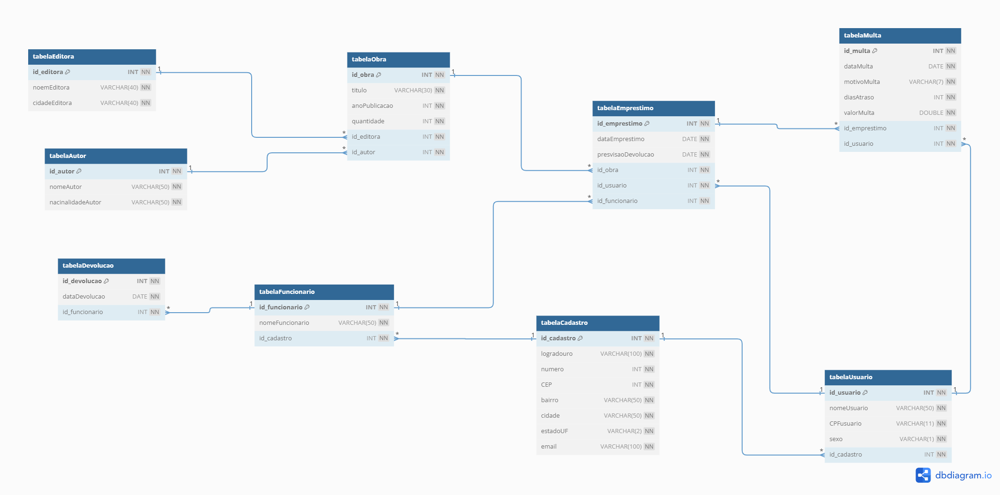
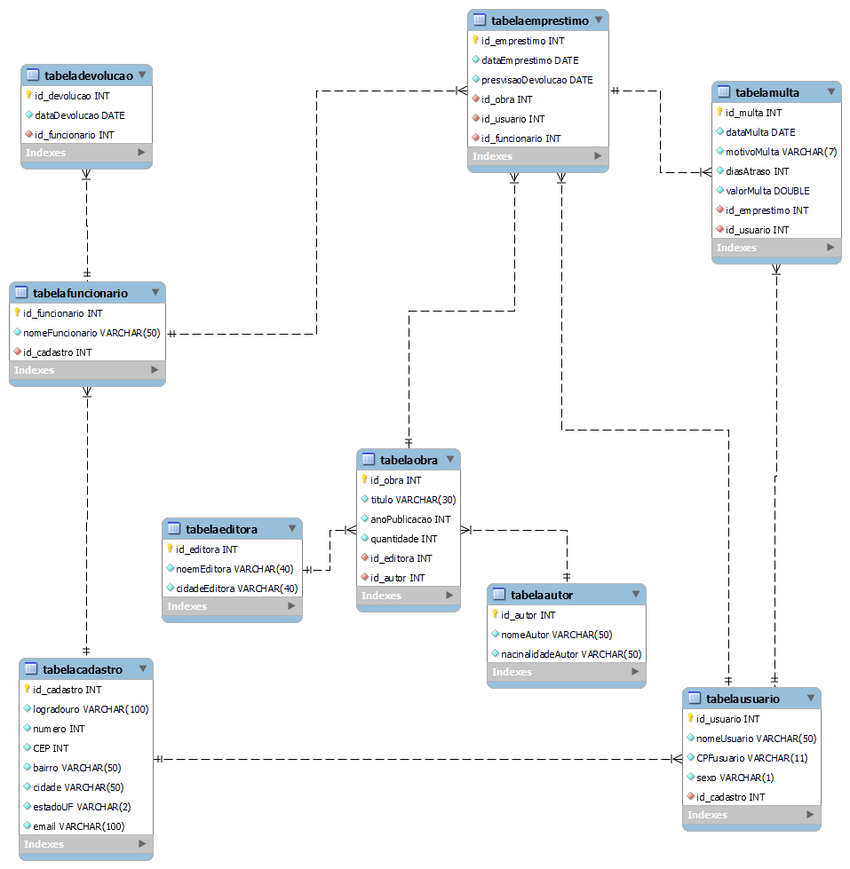

# BIBLIOTECA EM SQL

# Sistema de Gerenciamento de Biblioteca

Este é um projeto de banco de dados para um Sistema de Gerenciamento de Biblioteca. O objetivo é criar um sistema que permita o controle do fluxo de empréstimo de livros, bem como o cadastro de usuários, funcionários, obras, editoras, autores e multas.

## Requisitos

Para executar os scripts, certifique-se de ter instalado:

1. **Sistema Gerenciador de Banco de Dados (SGBD):** Certifique-se de ter um SGBD instalado em sua máquina. Os scripts foram desenvolvidos para serem executados no MySQL Workbench.

2. **Cliente SQL:** Utilize o MySQL compatível com MySQL Workbench para executar os scripts.

## Instruções

Siga os passos abaixo para criar e configurar o banco de dados da biblioteca:

1. **Criação do Banco de Dados:**
   - Abra o MySQL e conecte-se ao servidor do SGBD.
   - Execute o script `Biblioteca.sql` para criar o banco de dados "BIBLIOTECA" já com todas as tabelas necessárias.

2. **Inserção de Dados (Opcional):**
   - Se desejar, execute o script `inserts.sql` para inserir dados de exemplo nas tabelas criadas.

## Descrição das Tabelas

A seguir, uma breve descrição de cada tabela:

1. **tabelaCadastro:**
   - Armazena dados de endereço dos usuários e funcionários.

2. **tabelaFuncionario:**
   - Contém o nome dos funcionários e está relacionada com a tabelaCadastro.

3. **tabelaUsuario:**
   - Registra informações adicionais dos usuários e está relacionada com a tabelaCadastro.

4. **tabelaDevolucao:**
   - Controla as devoluções de exemplares com informações sobre a data e o funcionário responsável.

5. **tabelaEditora:**
   - Armazena nomes de editoras e suas cidades de origem.

6. **tabelaAutor:**
   - Contém informações sobre os autores e suas nacionalidades.

7. **tabelaObra:**
   - Guarda os livros da biblioteca, incluindo informações sobre título, ano de publicação, quantidade disponível, editora e autor.

8. **tabelaEmprestimo:**
   - Registra os empréstimos de obras para usuários, incluindo as datas de empréstimo e previsão de devolução, bem como os usuários e funcionários envolvidos.

9. **tabelaMulta:**
   - Controla as multas aplicadas aos usuários em caso de atraso na devolução, com detalhes sobre a data da multa, motivo, dias de atraso e valor.

## Observações

- Inicialmente foi criado uma planilha como base para inicio do banco de dados, após foi feita a criação do diagrama no dbDiagram.Io.

[planilha](./esquemas/tabela%20em%20planilha.pdf)

-Após a criação do banco de dados foi feuta a engenharia reversa para obter o diagrama direto pelo MySQL Workbench.

---(image.png)

Esse é o README para o seu projeto de Sistema de Gerenciamento de Biblioteca. Lembre-se de mantê-lo atualizado e incluir todas as informações necessárias para que outros desenvolvedores possam entender e utilizar o sistema adequadamente. Boa sorte com o seu projeto!